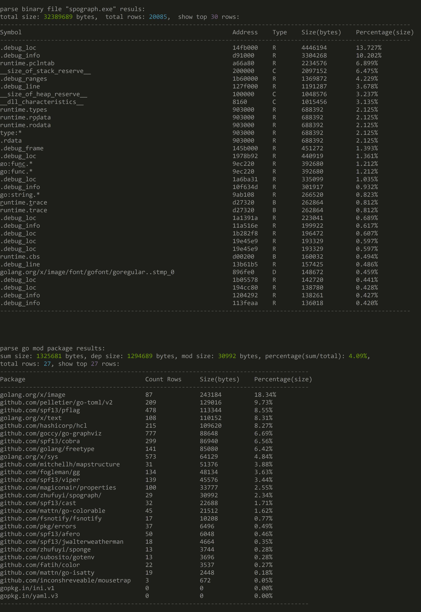

## English | [简体中文](readme-cn.md)

<br>

`goparser` is a parse tool for Golang source code, it can analyze the binary file composition of your project,
You can also compare the version of your `go.mod` dependency library with the latest version.

### Install

```go
go install github.com/zhufuyi/goparser@latest
```

### Usage

#### Parse binary file command

1. Compile your project using the `go build` command to generate binaries.

    > Note: Do not use the parameter `-ldflags "-s -w"` in the `go build` command.

2. Execute the following command:

    ```bash
    goparser binary -f ./spograph -n 30
    ```

    output:

    

    > For more command parameters, please use `goparser binary -h` to view.

<br>

#### Compare go.mod dependencies version command

execute the following command:

```bash
goparser mod -f ./go.mod
```

output:


> For more command parameters, please use `goparser mod -h` to view.
