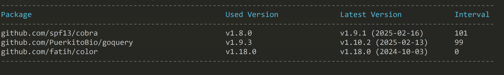

`goparser` 是一个用于解析 Golang 源码的工具，可以分析项目的二进制文件组成，还可以将你的 `go.mod` 依赖库版本与最新版本进行对比。

### 安装

```go
go install github.com/zhufuyi/goparser@latest
```

### 使用方法

#### **解析二进制文件命令**

1. 使用 `go build` 命令构建你的项目并生成二进制文件。

    > 注意：编译时不要使用参数 `-ldflags "-s -w"`。

2. 然后执行以下命令：

    ```bash
    goparser binary -f ./spograph -n 30
    ```

    输出示例：

    

    > 更多命令参数，请使用 `goparser binary -h` 查看。

<br>

#### **对比 go.mod 依赖包版本命令**

执行以下命令：

```bash
goparser mod -f ./go.mod
```

输出示例：



> 更多命令参数，请使用 `goparser mod -h` 查看。
